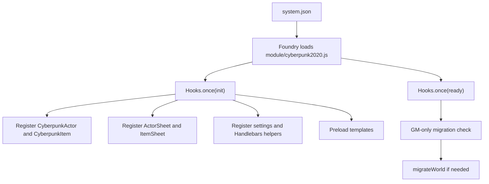

# Architecture Documentation

Last updated: 2026-05-24

## Executive Summary

Cyberpunk2020VTT uses a classic FoundryVTT system architecture: a manifest declares the package, one ES module bootstraps document classes and sheets, document subclasses prepare game data, sheet subclasses build template context and wire events, Handlebars templates render the UI, and Sass styles the rendered sheets and chat cards.

There is no independent application runtime. Foundry is the runtime, dependency provider, router, persistence layer, document model, UI shell, and compendium loader.

## Runtime Architecture

## Main Layers

### Bootstrap

`module/cyberpunk2020.js` owns Foundry integration:

- exposes `game.cyberpunk.entities`
- exposes `game.cyberpunk.migrateWorld`
- sets `CONFIG.Actor.documentClass` and `CONFIG.Item.documentClass`
- unregisters core sheets and registers system sheets
- registers system settings
- registers helpers
- preloads templates
- checks migration version in `ready`

### Actor Domain

`CyberpunkActor` in `module/actor/actor.js` is responsible for actor data and actor-level rolls.

Key responsibilities:

- default character token configuration on create
- default skill item seeding from `cyberpunk2020.default-skills`
- derived stats in `prepareData`
- hit-location lookup construction
- equipped armor stopping power aggregation
- encumbrance REF modifier
- movement, carry, lift, BTM
- wound penalties
- humanity loss and EMP adjustment from equipped cyberware
- skill/stat/stun/death/initiative rolls

### Actor Sheet

`CyberpunkActorSheet` in `module/actor/actor-sheet.js` prepares sheet context and event handlers.

Key responsibilities:

- sheet options and tabs
- item grouping for gear/combat/cyberware views
- skill filtering and sorting context
- wound state labels
- stat, skill, initiative, wound, item, delete, and weapon-fire listeners
- launching `ModifiersDialog` before weapon rolls

### Item Domain

`CyberpunkItem` in `module/item/item.js` owns item behavior.

Key responsibilities:

- item type preparation switch for weapons and armor
- ranged/melee classification
- armor coverage morphing to actor hit locations
- weapon roll dispatch by fire mode
- attack roll construction
- semi-auto, three-round burst, full-auto, melee, martial-art roll flows
- vehicle acceleration/deceleration

The item layer is currently the largest behavioral concentration and the main refactor candidate.

### Item Sheet

`CyberpunkItemSheet` in `module/item/item-sheet.js` prepares item-specific select choices and item listeners.

Key responsibilities:

- one shared item sheet template for all item types
- type-specific preparation for weapon, armor, and skill item data
- dynamic attack skill options
- humanity loss roll for cyberware
- vehicle accel/decel listeners

### Roll and Chat Layer

`module/dice.js` provides:

- `BaseDie = "1d10x10"`
- `makeD10Roll(terms, rollData)`
- `classifyRollDice(roll)`
- `Multiroll`, a reusable abstraction for multi-roll chat cards

Combat code uses both `Multiroll` and direct `Roll` instances. Chat rendering depends on templates under `templates/chat/`.

### Template Layer

Templates are split by UI surface:

- `templates/actor/actor-sheet.hbs` delegates to actor partials.
- `templates/actor/parts/*.hbs` render stats, wound tracker, skills, combat, gear, cyberware, and armor display.
- `templates/item/item-sheet.hbs` dynamically selects type-specific partials.
- `templates/item/parts/*/settings.hbs` and `summary.hbs` render item type sections.
- `templates/fields/*.hbs` provide reusable field controls.
- `templates/dialog/modifiers.hbs` renders attack modifier forms.
- `templates/chat/*.hbs` render roll cards.

### Styling Layer

The styling source is `scss/cyberpunk2020.scss`, importing partials for fields, interactivity, stats, wounds, skills, item sheets, gear, cards, and combat.

The compiled artifact `css/cyberpunk2020.css` is loaded by Foundry through `system.json`.

## Data Architecture

### Actor Types

`template.json` declares:

- `character`
- `npc`

Both currently use the character preparation path in `CyberpunkActor.prepareData`; NPCs differ mainly in default create behavior.

### Item Types

`template.json` declares:

- `skill`
- `weapon`
- `armor`
- `cyberware`
- `vehicle`
- `misc`

All item types except `skill` use the common item template. Type-specific fields are rendered by dynamic item partials.

### Compendium Packs

The repository contains item packs for default skills, role skills, weapons, armor, cyberware/chipware, gear categories, vehicles, and roll tables. Runtime code directly depends on the `default-skills` pack for new actor initialization and migration.

## Settings

`module/settings.js` registers:

- `cyberpunk2020.systemMigrationVersion`, world scope, hidden config
- `cyberpunk2020.trainedSkillsFirst`, client scope, configurable

The skill sorting code reads `trainedSkillsFirst`.

## Migrations

Migration execution is GM-only and version-gated from `module/cyberpunk2020.js`.

Current migration responsibilities:

- normalize `system.damage` from string to number
- update character token linking and vision defaults
- migrate old actor skill data into item skills
- add missing common `source` fields to items
- add missing `rangeDamages` to weapons
- attempt unlocked compendium migration

Migration code is a high-risk refactor area because it currently mixes async operations with un-awaited calls in several loops.

## Architectural Risks

- Some derived actor data is written by direct mutation inside `prepareData`, which is normal for derived values but dangerous if the same pattern spreads to persisted state.
- Item behavior, roll logic, ammo updates, and chat rendering are tightly coupled in `module/item/item.js`.
- Several update calls are not awaited where ordering may matter.
- Template paths are hardcoded in multiple places.
- Foundry v12 compatibility is partially accommodated (`getStatNames`) but the architecture is still v10/v11-era sheet/document style.
- There is no automated regression harness, so runtime verification depends on Foundry manual checks.

## Refactor Direction

The architecture does not need a new framework to become maintainable. The best refactor path is incremental:

1. Stabilize async document update flows.
2. Split weapon roll logic into smaller functions/modules while preserving `CyberpunkItem` as the public behavior owner.
3. Clarify persisted state vs derived state.
4. Add migration discipline around `template.json` changes.
5. Add a lightweight test or fixture strategy only after seams are clearer.
