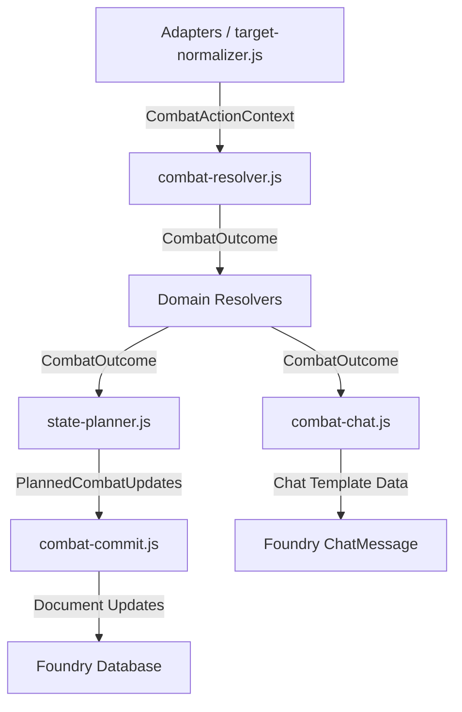

# Resolver Contracts Reference

This document serves as the master reference for all public contract shapes used across the combat resolver pipeline.

> [!IMPORTANT]
> The JSDoc typedefs located in `module/combat/combat-outcome.js` remain the authoritative source of truth for these shapes. If this document and the JSDoc definitions diverge, the JSDoc definitions in `combat-outcome.js` should be treated as canonical.

## Data Flow

The canonical combat data flow follows a strictly layered approach:

## Contracts

### `CombatActionContext`
* **Defined In**: `combat-outcome.js`
* **Purpose**: Input parameters passed to the resolver.
* **Key Fields**: `type`, `fireMode`, `range`, `targetArea`, `options`, `modifiers`, `source`

### `CombatOutcome`
* **Defined In**: `combat-outcome.js`
* **Purpose**: The final accumulated state returned by `resolveCombatAction()`.
* **Key Fields**: `action`, `attacker`, `weapon`, `targets[]`, `ammo`, `manualResolution`, `warnings`, `pendingDecisions`, `chat`

### `CombatActorRef` & `CombatTargetRef`
* **Defined In**: `combat-outcome.js`
* **Purpose**: UUID-aware references for combat actors/tokens inside a combat action context. Captures display names and optional structural snapshots (`ActorCombatSnapshot`).
* **Tactical Context (`target.tactical`)**: An optional sub-object present during tactical targeting containing:
  * `selected` (boolean): `true` if this target was acquired via traditional token selection.
  * `template`: When intersected by an AoE, contains `templateUuid`, `templateId`, `type`, `origin`, `direction`, `angle`, `width`, `distance`, `targetDistance`, and `inclusion` ("intersected" or "manual_decision").
  * `raycast`: When acquired via sightline/raycast, contains `origin`, `destination`, optional obstruction evidence, `obstructionDistance`, `firstTarget`, and `requiresGmDecision`.
* **Distance (`target.distance`)**: Optional measured distance data (`value`, `units`, `source`).
* **Manual Tactical Decisions**: Missing requested template/raycast context, `manual_decision` template inclusion, or `requiresGmDecision` raycast evidence must set `target.manualResolution.required` and block automated target damage, armor, and save updates.

### `WeaponCombatSnapshot` & `ActorCombatSnapshot`
* **Defined In**: `combat-outcome.js`
* **Purpose**: Plain data captured from Foundry documents before resolution begins. Isolates resolvers from active Foundry object mutations.

### `RollMetadata`
* **Defined In**: `combat-outcome.js`
* **Purpose**: Encapsulates roll results.
* **Key Fields**: `formula`, `total`, `die` (natural results), `isCritical`, `isFumble`, `isJam`

### `CombatAttackOutcome`
* **Defined In**: `combat-outcome.js`
* **Purpose**: Represents the attack phase result per target.
* **Key Fields**: `roll`, `targetNumber`, `opposedRoll`, `hit`, `margin`, `warnings`

### `CombatHitRecord`
* **Defined In**: `combat-outcome.js`
* **Purpose**: Encapsulates damage and armor logic per successful hit.
* **Key Fields**: `location`, `damageRoll`, `rawDamage`, `effectiveStoppingPower`, `armorPiercing`, `armorMitigation`, `penetratingDamage`, `bodyTypeMitigation`, `finalDamage`, `woundDamage`, `woundTransition`, `specialCases`

### `CombatSavePrompt`
* **Defined In**: `combat-outcome.js`
* **Purpose**: Represents a requested stun or death save.
* **Key Fields**: `type` ("stun" or "death"), `threshold`, `status` ("pending", "passed", "failed"), `penalty`, `mortalLevel`

### `ManualResolution`
* **Defined In**: `combat-outcome.js`
* **Purpose**: Flags when automation must abort and defer to the referee.
* **Key Fields**: `required` (boolean), `reason`, `message`, `blockedUpdateCategories`

### `CombatWarning`
* **Defined In**: `combat-outcome.js`
* **Purpose**: Represents an issue or edge case that requires referee attention.
* **Key Fields**: `code`, `severity`, `message`, `localizationKey`, `source`

### `PlannedCombatUpdates`
* **Defined In**: `combat-outcome.js`
* **Purpose**: State plans produced by `state-planner.js` for `combat-commit.js` to execute.
* **Key Fields**: `actorUpdates[]`, `itemUpdates[]`, `embeddedItemUpdates[]`, `chatStatus`

## Commit Flow

Updates must be applied using awaited Foundry APIs in this deterministic order:
1. Attacker Ammo (`itemUpdates`)
2. Target Armor Ablation (`embeddedItemUpdates`)
3. Target Wounds/Damage (`actorUpdates`)
4. Target Save State (`actorUpdates`)
5. Chat Updates (`ChatMessage`)

If `manualResolution.required` is true, or if preview is canceled, the `combat-commit.js` process will bypass applying the mutations.

## Chat Derivation

The `buildCombatChatData()` function builds template data strictly by reading the `CombatOutcome` and `PlannedCombatUpdates`. 
**Rule:** It must never read live `Actor` or `Item` state from Foundry documents.

## Fixture Expectations

The project tests mechanics without a live Foundry environment.
- **Test Runner**: `tests/run-combat-fixtures.mjs` (Node.js script)
- **Fixtures Location**: `tests/combat/fixtures/*.json`
- **Pattern**: The test runner injects a deterministic random roller, invokes `resolveCombatAction()`, and uses snapshot-based matching against the defined contracts.
- **Coverage Map**: Tracked automatically in `tests/combat/fixture-coverage-map.md`.
